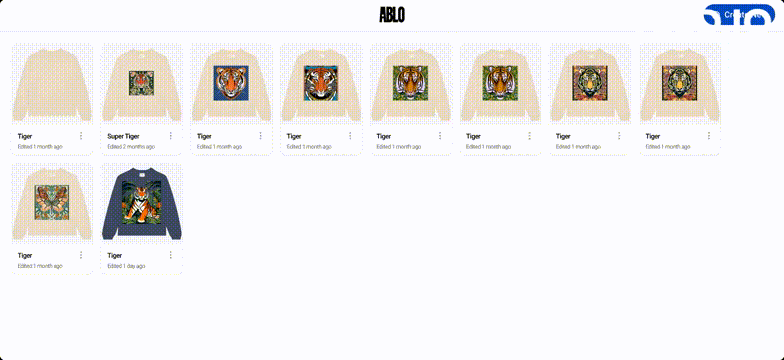

# Ablo React SDK

Welcome to Ablo React SDK, a powerful React UI library designed for creating AI-generated images and designing clothing apparel using a versatile editor. With Ablo React SDK, you can easily resize, crop, and rotate your images, as well as add and style text to bring your creative visions to life.

## Walkthrough

Explore the features and capabilities of Ablo React SDK in this quick walkthrough. See how easy it is to create AI-generated images and design clothing apparel using our intuitive editor.



## Table of Contents

- [Installation](#installation)
- [Usage](#usage)
- [Components](#components)
- [Contributing](#contributing)
- [License](#license)

## Installation

To integrate Ablo React SDK into your project, install it via npm or yarn.

```bash
npm install ablo-demo-fe
# or
yarn add ablo-demo-fe
```

## Usage

Utilize the rich set of components provided by Ablo React SDK to enhance your AI image generation and clothing apparel design experience.

### Example with a full fledged Ablo editor

```jsx
import { EditorTool } from 'ablo-demo-fe';

function DesignApparel() {
  return (
    <div>
      <EditorTool
        design={activeDesign}
        onDesignChange={(design) => {}}
        onSave={() => handleSaveDesign()}
        templates={templates}
      />
    </div>
  );
}
```

### Example with a custom editor where Ablo React SDK provides the layout and AI image generation.

```jsx
import { EditorContainer, EditorControls } from 'ablo-demo-fe';

function DesignApparel() {
  return (
    <div>
      <EditorContainer
        onImageUploaded={(image) => handlePreviewImageSelected({ url: image.src })}
        onGeneratedImageSelected={handlePreviewImageSelected}
        isEditorToolbarExpanded={isEditorToolbarExpanded}
        onChangeEditorToolbarExpanded={setEditorToolbarExpanded}
        generateImageFromText={generateImage}
        getStyles={getStyles}
        hideAiImageBackgroundSelector
        hideStyles
        availableTools={[ToolType.TEXT_TO_IMAGE]}
      >
        <EditorControls />
        <span>My custom editor here</span>
      </EditorContainer>
    </div>
  );
}
```

## Components

Ablo React SDK offers a variety of components tailored for AI image generation and apparel design, including:

- **EditorContainer:** Provides an interface and layout to generate an AI image and place it in your own custom editor.
- **EditorTool:** Provides a complete 2D editor that can overlay an AI image or custom images and text on a template.
- **EditorControls:** Provides a toolbar with common controls for Undo/Redo, rotate, save and others. It's up to the consumer to implement those actions.

## EditorContainer

Here's a breakdown of each property that can be passed to the `EditorContainer` component:

- **`onImageUploaded`**: Callback when an image is uploaded from disk or device to the editor.

  - Type: `(image: HTMLImageElement) => void`

- **`onImagesPreview`** (Optional): Callback for previewing multiple AI generated images.

  - Type: `(images: string[]) => void`

- **`onGeneratedImageSelected`**: Callback when a generated image is selected. The `AiImage` type includes the generated image URL and the prompts used to generate it.

  - Type: `(image: AiImage) => void`

- **`isEditorToolbarExpanded`**: Boolean to determine if the editor toolbar (the draggable overlay at the bottom) is expanded.

  - Type: `boolean`

- **`onChangeEditorToolbarExpanded`**: Callback to change the editor toolbar's expansion state.

  - Type: `(isExpanded: boolean) => void`

- **`children`**: Children components to be rendered inside the editor container.

  - Type: `React.ReactNode`

- **`getStyles`**: Function to retrieve styles based on a specified type. This can be a call to Ablo Demo BE as in the Demo FE app, or a custom implementation.

  - Type: `(type: StyleType) => Promise<Style[]>`

- **`generateImageFromText`**: Function to generate an image from text. This can be a call to Ablo Demo BE as in the Demo FE app, or a custom implementation.

  - Type: `(options: TextToImageRequest) => Promise<string[]>`

- **`generateImageFromImage`** (Optional): Function to generate an image from another image. Function to generate an image from text. This can be a call to Ablo Demo BE as in the Demo FE app, or a custom implementation.

  - Type: `(options: ImageToImageRequest) => Promise<string[]>`

- **`generateImageFromFont`** (Optional): Function to generate an image from a font. Function to generate an image from text. This can be a call to Ablo Demo BE as in the Demo FE app, or a custom implementation.

  - Type: `(options: FontToImageRequest) => Promise<string[]>`

- **`hideAiImageBackgroundSelector`** (Optional): Boolean to hide the AI image background selector.

  - Type: `boolean`

- **`hideStyles`** (Optional): Boolean to hide the styles in the editor.

  - Type: `boolean`

- **`customToolbarContent`** (Optional): Custom content to be added to the toolbar. In some cases you might not want to show Ablo tools in the bottom toolbar, but something completely custom like your own color picker interface.

  - Type: `React.ReactNode`

- **`buttonProps`** (Optional): Button props for basic and outlined styles. It allows overriding of the default button styles in the editor bottom toolbar.

  - Type:
    ```tsx
    {
      basic: ButtonProps;
      outlined: ButtonProps;
    }
    ```

- **`availableTools`** (Optional): Array of available tools in the editor. Allows restricting what tools can be used (for example, just Text to Image).

  - Type: `ToolType[]`

- **`subjectText`** (Optional): Text to be used as the subject in the editor.

  - Type: `string`

- **`maxToolbarHeight`** (Optional): Maximum height for the toolbar.
  - Type: `number`

## EditorTool

Here's a breakdown of each property that can be passed to the `EditorTool` component:

- **`design`**: The current design object. It's up to the consumer to persist the design in some storage or all designs will be lost after the user closes the browser.

  - Type: `Design`

- **`onDesignChange`**: Callback function triggered when the design changes. While editing the design the user might not want to save it on every small edit. This callback lets the consumer know about those small changes in case it wants to implement a quicksave feature.

  - Type: `(design: Design) => void`

- **`onSave`**: Callback function triggered when the user explicitly saves the design.

  - Type: `() => void`

- **`templates`**: An array of template objects. Templates can be everything from T-Shirts to Skateboards, but they have to implement the `Template` interface
  - Type: `Template[]`

## EditorControls

Here's a breakdown of each property that can be passed to the `EditorControls` component:

- **`design`**: The current design object. The Save icon will be shown only if this is not null.

  - Type: `Design`

- **`onAddText`**: Callback function triggered when adding text to the design.

  - Type: `(props: object) => void`

- **`onSelectedSide`** (Optional): Callback function triggered when a side is selected. Every physical template has one or more sides. For example, a T-shirt has front and back.

  - Type: `(side: string) => void`

- **`onUndo`** (Optional): Callback function triggered when the user performs an undo action.

  - Type: `() => void`

- **`onRedo`** (Optional): Callback function triggered when the user performs a redo action.

  - Type: `() => void`

- **`onSave`**: Callback function triggered when the user saves the design.

  - Type: `() => void`

- **`selectedSide`** (Optional): The currently selected side.
  - Type: `string`

## Contributing

We welcome contributions from the community!

## License

Ablo React SDK is open-source software licensed under the [MIT License](./LICENSE). Feel free to use, modify, and distribute it as needed.

Unleash your creativity with Ablo React SDK! 🎨🚀
